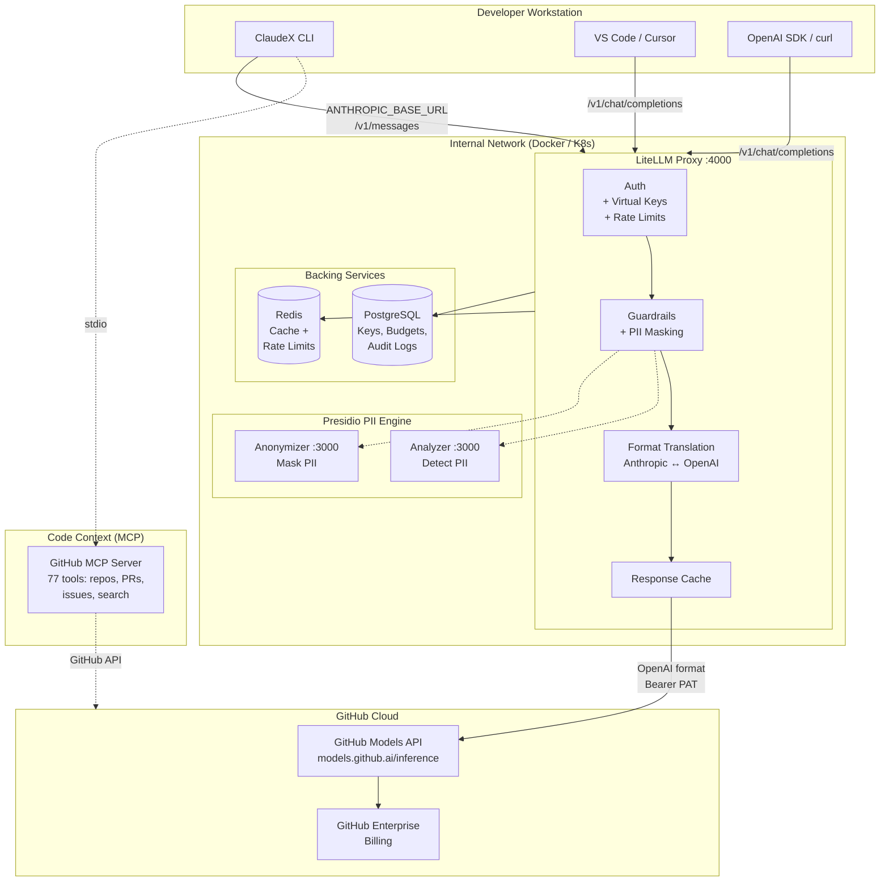
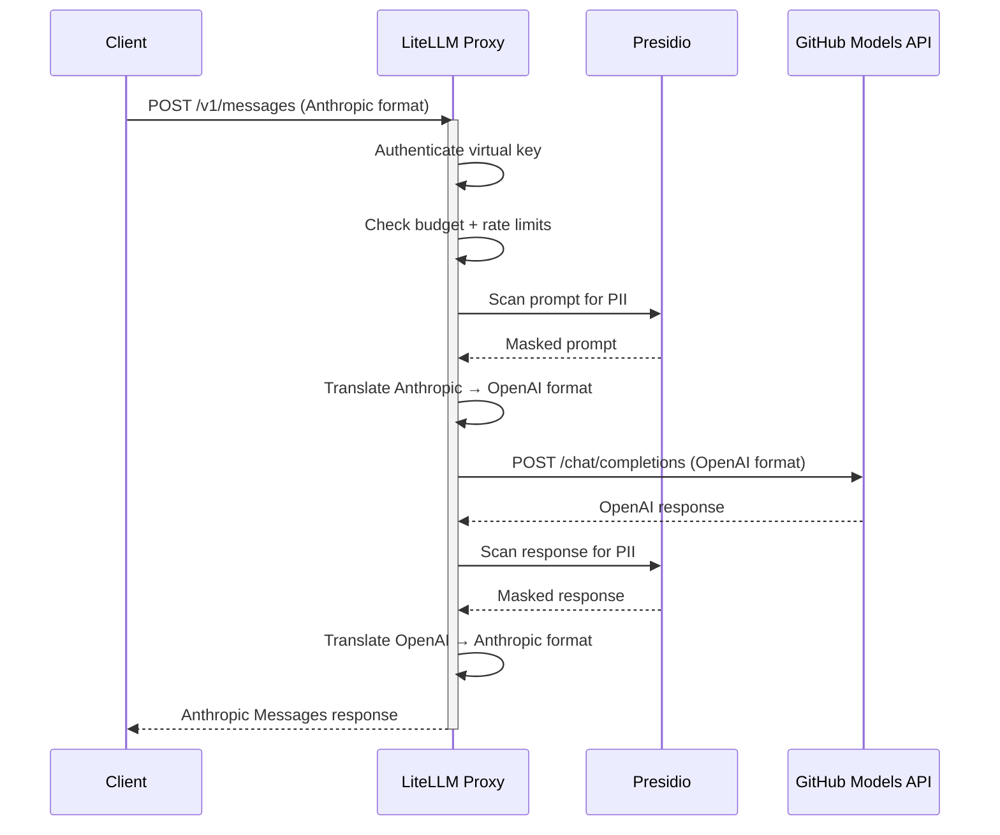

# ClaudeX

Enterprise AI gateway that routes LLM requests through [GitHub Models API](https://docs.github.com/en/github-models), enabling centralized billing via GitHub Enterprise.

Built on [LiteLLM Proxy](https://github.com/BerriAI/litellm) with PII masking, rate limiting, team-based API keys, and full audit logging.

## Architecture



### Request Flow



## Available Models

### Models via GitHub Models API

The following models are billed through GitHub Enterprise via the GitHub Models API:

| Alias | Provider | GitHub Model ID |
|-------|----------|-----------------|
| `gpt-4.1` | OpenAI | `openai/gpt-4.1` |
| `gpt-4.1-mini` | OpenAI | `openai/gpt-4.1-mini` |
| `gpt-4.1-nano` | OpenAI | `openai/gpt-4.1-nano` |
| `gpt-4o` | OpenAI | `openai/gpt-4o` |
| `o3-mini` | OpenAI | `openai/o3-mini` |
| `o4-mini` | OpenAI | `openai/o4-mini` |
| `llama-4-scout` | Meta | `meta/llama-4-scout-17b-16e-instruct` |
| `llama-4-maverick` | Meta | `meta/llama-4-maverick-17b-128e-instruct-fp8` |
| `llama-3.3-70b` | Meta | `meta/llama-3.3-70b-instruct` |
| `deepseek-r1` | DeepSeek | `deepseek/deepseek-r1` |
| `mistral-medium` | Mistral | `mistral-ai/mistral-medium-2505` |
| `codestral` | Mistral | `mistral-ai/codestral-2501` |
| `grok-3` | xAI | `xai/grok-3` |
| `grok-3-mini` | xAI | `xai/grok-3-mini` |

### Claude Models via Anthropic API

Claude models are available through direct Anthropic API integration:

| Alias | Provider | Model ID | Context Window |
|-------|----------|----------|----------------|
| `claude-sonnet-4.5` | Anthropic | `claude-sonnet-4-5-20250929` | 200K tokens |
| `claude-opus-4.6` | Anthropic | `claude-opus-4-6-20260205` | 1M tokens |
| `claude-haiku-4.5` | Anthropic | `claude-haiku-4-5-20250820` | 200K tokens |
| `claude-sonnet` | Anthropic | Alias for Sonnet 4.5 | 200K tokens |
| `claude-opus` | Anthropic | Alias for Opus 4.6 | 1M tokens |

**Authentication Options for Claude Models:**

1. **Direct Anthropic API** (Recommended): Set `ANTHROPIC_API_KEY` in `.env` with your Anthropic API key
2. **GitHub Copilot Business**: See [Authentication with GitHub Copilot](#authentication-with-github-copilot) section below

## Quick Start

### Prerequisites

- Docker + Docker Compose
- GitHub PAT with `models:read` scope ([create one](https://github.com/settings/tokens?type=beta))

### 1. Setup

```bash
git clone https://github.com/demirelh/claudex.git
cd claudex
make setup
```

This will:
- Create `.env` from template (you fill in your GitHub PAT)
- Start all services (LiteLLM, PostgreSQL, Redis, Presidio)
- Run a smoke test

### 2. Verify

```bash
make status
# or
make test-quick
```

### 3. Use

```bash
# Set in your shell profile
export ANTHROPIC_BASE_URL=http://localhost:4000
export ANTHROPIC_AUTH_TOKEN=<your-litellm-master-key>

# ClaudeX works through the gateway
claude

# Or use curl directly (OpenAI format)
curl -X POST http://localhost:4000/v1/chat/completions \
  -H "Authorization: Bearer $ANTHROPIC_AUTH_TOKEN" \
  -H "Content-Type: application/json" \
  -d '{
    "model": "gpt-4.1-mini",
    "messages": [{"role": "user", "content": "Hello!"}],
    "max_tokens": 100
  }'

# Anthropic Messages format also works
curl -X POST http://localhost:4000/v1/messages \
  -H "Authorization: Bearer $ANTHROPIC_AUTH_TOKEN" \
  -H "Content-Type: application/json" \
  -H "anthropic-version: 2023-06-01" \
  -d '{
    "model": "gpt-4.1-mini",
    "max_tokens": 100,
    "messages": [{"role": "user", "content": "Hello!"}]
  }'
```

## Team Key Management

Create per-team API keys with budget limits and model restrictions:

```bash
# Auto-create keys for predefined teams
make keys

# Or manually
curl -X POST http://localhost:4000/key/generate \
  -H "Authorization: Bearer $LITELLM_MASTER_KEY" \
  -H "Content-Type: application/json" \
  -d '{
    "team_id": "team-backend",
    "max_budget": 100.0,
    "budget_duration": "30d",
    "models": ["gpt-4.1", "gpt-4.1-mini", "deepseek-r1"]
  }'
```

Each team key enforces:
- **Budget cap** (monthly spend limit)
- **Model allowlist** (only specified models accessible)
- **Rate limits** (configurable per key)

## Project Structure

```
claudex/
├── config/
│   ├── litellm-config.yaml      # Model routing, guardrails, cache config
│   └── managed-mcp.json         # Org-wide MCP policy template
├── docker-compose.yaml          # Local dev: LiteLLM + Postgres + Redis + Presidio
├── .env.example                 # Environment variable template
├── .mcp.json                    # GitHub MCP Server config for projects
├── Makefile                     # All common operations
├── scripts/
│   ├── setup.sh                 # First-time setup
│   ├── create-team-keys.sh      # Generate team API keys
│   └── test-gateway.sh          # Quick validation without pytest
├── tests/                       # pytest test suite
│   ├── test_health.py           # Health probes
│   ├── test_auth.py             # Auth + virtual keys
│   ├── test_anthropic_format.py # Anthropic Messages API translation
│   ├── test_openai_format.py    # OpenAI Chat Completions passthrough
│   ├── test_streaming.py        # SSE streaming (both formats)
│   ├── test_tool_use.py         # Function calling / tool use
│   ├── test_pii_redaction.py    # Presidio PII masking
│   └── test_rate_limiting.py    # Budget limits + model restrictions
├── k8s/
│   ├── base/                    # Kustomize base (namespace, deployments, network policies, HPA)
│   └── overlays/production/     # Production overlay (higher replicas, resources)
└── docs/
    └── PLAN.md                  # Full architecture plan & implementation brief
```

## Makefile Commands

```
make setup            # First-time setup (env, start, smoke test)
make up               # Start all services
make down             # Stop all services
make restart          # Restart all services
make status           # Show service status + health check
make logs             # Tail all service logs
make logs-litellm     # Tail LiteLLM logs only
make keys             # Create team virtual keys
make test             # Run full pytest suite
make test-quick       # Quick curl-based validation
make test-integration # Integration tests only
make test-guardrails  # PII/guardrail tests only
make k8s-deploy-base  # Deploy to Kubernetes (base)
make k8s-deploy-prod  # Deploy to Kubernetes (production)
make clean            # Remove containers + volumes
```

## Kubernetes Deployment

```bash
# Validate manifests
make k8s-dry-run

# Deploy base config (2 replicas)
make k8s-deploy-base

# Deploy production overlay (3+ replicas, higher resources)
make k8s-deploy-prod
```

The K8s setup includes:
- **Pod Security Standards**: `restricted` profile
- **NetworkPolicies**: Egress only to `models.github.ai:443`
- **HPA**: auto-scale 2-8 (base) or 3-16 (prod) replicas on CPU/memory
- **PDB**: minimum 1 pod always available
- **Ingress**: internal-only with IP whitelist and SSE streaming support

## Security

- **PII Masking**: Presidio scans all prompts/responses for credit cards, emails, IBANs, phone numbers, SSNs, and GitHub PATs before they reach the LLM
- **Auth**: Every request requires a valid API key (master or virtual team key)
- **Budget Controls**: Per-team spending limits with configurable durations
- **Model Restrictions**: Team keys can be locked to specific models
- **Network Isolation**: K8s NetworkPolicies restrict egress to GitHub APIs only
- **No secrets in logs**: API keys are never logged; Presidio masks sensitive data in log output

See [docs/PLAN.md](docs/PLAN.md) for the full security checklist (OWASP, SSRF, prompt injection mitigations).

## Configuration

### Adding Models

Edit `config/litellm-config.yaml` and add a new entry. Model names come from `gh models list`:

```yaml
- model_name: "my-alias"          # Name your users will use
  litellm_params:
    model: "openai/<provider>/<model-id>"  # From GitHub Models catalog
    api_key: "os.environ/GITHUB_MODELS_PAT"
    api_base: "https://models.github.ai/inference"
```

Restart with `make restart` after config changes.

### Environment Variables

See [.env.example](.env.example) for all available variables.

**Required for GitHub Models API:**

| Variable | Description |
|----------|-------------|
| `GITHUB_MODELS_PAT` | GitHub PAT with `models:read` scope |
| `LITELLM_MASTER_KEY` | Admin key for proxy management |
| `POSTGRES_PASSWORD` | PostgreSQL password |
| `DATABASE_URL` | Full PostgreSQL connection string |

**Required for Claude models:**

| Variable | Description |
|----------|-------------|
| `ANTHROPIC_API_KEY` | Anthropic API key from console.anthropic.com |

## Authentication with GitHub Copilot

If you have a **GitHub Copilot Business** subscription and want to use it to access Claude models instead of getting a separate Anthropic API key:

👉 **[Complete Step-by-Step Guide for GitHub Copilot Business Users →](docs/GITHUB-COPILOT-SETUP.md)**

### Quick Summary - Two Options

#### Option 1: Use Claude Code CLI with GitHub Copilot (Simplest)

The official Claude Code CLI can use your GitHub Copilot subscription:

1. Install Claude Code: `npm install -g @anthropics/claude-code-cli`
2. Configure to use GitHub Copilot:
   ```bash
   claude-code auth github-copilot
   ```
3. Use it directly (it bypasses ClaudeX gateway)

**Best for:** Individual developers, simple setup (5 minutes)

#### Option 2: Proxy GitHub Copilot through ClaudeX (Advanced)

For centralized control and PII masking, you can configure ClaudeX to proxy requests to GitHub's Copilot API:

1. **Get your GitHub Copilot token:**
   ```bash
   # In VS Code with Copilot enabled
   # Open Command Palette (Cmd/Ctrl+Shift+P)
   # Run: "GitHub Copilot: Show API Token"
   ```

2. **Update your `.env` file:**
   ```bash
   ANTHROPIC_API_KEY=<your-github-copilot-token>
   ```

3. **Start ClaudeX and configure Claude CLI:**
   ```bash
   make setup
   export ANTHROPIC_BASE_URL=http://localhost:4000
   export ANTHROPIC_AUTH_TOKEN=<your-litellm-master-key>
   claude
   ```

**Best for:** Teams needing PII masking, audit logs, budget controls

**Note:** GitHub Copilot tokens expire and need to be refreshed periodically. For production use, consider using a direct Anthropic API key instead.

📖 **[See detailed guide with troubleshooting →](docs/GITHUB-COPILOT-SETUP.md)**

## Using Claude Models

Once configured, Claude models work just like any other model:

```bash
# Set environment variables
export ANTHROPIC_BASE_URL=http://localhost:4000
export ANTHROPIC_AUTH_TOKEN=<your-litellm-master-key>

# Use Claude CLI
claude

# Or via curl
curl -X POST http://localhost:4000/v1/messages \
  -H "Authorization: Bearer $ANTHROPIC_AUTH_TOKEN" \
  -H "Content-Type: application/json" \
  -H "anthropic-version: 2023-06-01" \
  -d '{
    "model": "claude-sonnet-4.5",
    "max_tokens": 1024,
    "messages": [{"role": "user", "content": "Hello!"}]
  }'
```

## License

Internal use only.
